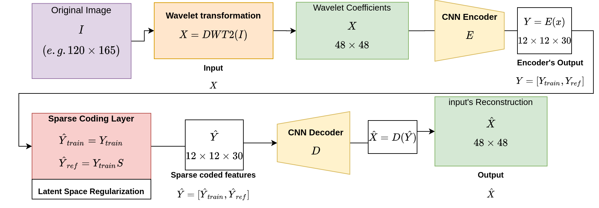

# MMSP-2020
MMSP project
# Convolution Autoencoder-Based Sparse Representation Wavelet for Image Classification

## Overview
We propose an effective Convolutional Autoencoder (AE) model for Sparse Representation (SR) in the Wavelet Domain for Classification (SRWC). The proposed approach involves an autoencoder with a sparse latent layer for learning sparse codes of wavelet features. The estimated sparse codes are used for assigning classes to test samples using a residual-based probabilistic criterion. Intensive experiments carried out on various datasets revealed that the proposed method yields better classification accuracy while exhibiting a significant reduction in the number of network parameters, compared to several recent deep learning-based methods.

## Citation

Please use the following to refer to this work:

<pre><code>
@INPROCEEDINGS{9287107,
  author={T. -S. {Nguyen} and L. H. {Ngo} and M. {Luong} and M. {Kaaniche} and A. {Beghdadi}},
  booktitle={2020 IEEE 22nd International Workshop on Multimedia Signal Processing (MMSP)}, 
  title={Convolution Autoencoder-Based Sparse Representation Wavelet for Image Classification}, 
  year={2020},
  volume={},
  number={},
  pages={1-6},
  doi={10.1109/MMSP48831.2020.9287107}}
</code></pre>

T. -S. Nguyen, L. H. Ngo, M. Luong, M. Kaaniche and A. Beghdadi, "Convolution Autoencoder-Based Sparse Representation Wavelet for Image Classification," 2020 IEEE 22nd International Workshop on Multimedia Signal Processing (MMSP), Tampere, 2020, pp. 1-6, doi: 10.1109/MMSP48831.2020.9287107.

